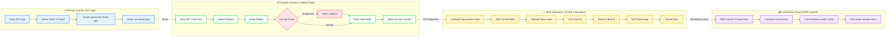

# LEEP Digital Inflow - Business Flow

```mermaid
flowchart LR
    classDef app fill:#e3f2fd,stroke:#3b82f6,stroke-width:2px;
    classDef web fill:#f0fdf4,stroke:#22c55e,stroke-width:2px;
    classDef vcrm fill:#fef3c7,stroke:#eab308,stroke-width:2px;
    classDef core fill:#f3e8ff,stroke:#a855f7,stroke-width:2px;
    classDef alert fill:#ffe4e6,stroke:#ef4444,stroke-width:2px;

    subgraph Referrer_Journey ["📱 Referrer Journey (SOL App)"]
        direction TB
        A1[Open SOL App] --> A2[Select 'Refer a Friend']
        A2 --> A3[System generates Static QR]
        A3 --> A4[Share via Social Apps]
    end

    subgraph Prospect_Journey ["🌐 Prospect Journey (Landing Page)"]
        direction TB
        B1[Scan QR / Click Link] --> B2[Select Product]
        B2 --> B4[Enter Details]
        B4 --> B5{Anti-bot Check}
        B5 -- "Suspicious" --> B6[Solve Captcha] --> B7[Pass Verification]
        B5 -- "Normal" --> B7
        B7 --> B8[Show Success Screen]
    end
    
    subgraph Bank_Operations ["🏢 Bank Operations (VCRM & Branches)"]
        direction TB
        C1[Landing Page pushes Lead] --> C2[ZNS Confirmation]
        C2 --> C3[Telesale 'New Lead']
        C3 --> C4[Call & Enrich]
        C4 --> C5[Route to Branch]
        C5 --> C6[RM 'Processing'] --> C7['Closed Won']
    end
    
    subgraph Commission_Payout ["💰 Commission Payout (PBD System)"]
        direction TB
        D1[PBD extracts 'Closed Won'] --> D2[Calculate Commission]
        D2 --> D3[Core Banking credits CASA]
        D3 --> D4[ZNS sends reward notice]
    end
    
    A4 -.->|Share| B1
    B8 -.->|API Integration| C1
    C7 -.->|Batch/Daily Sync| D1

    class A1,A2,A3,A4 app;
    class B1,B2,B3,B4,B7,B8 web;
    class B5,B6 alert;
    class C1,C2,C3,C4,C5,C6,C7 vcrm;
    class D1,D2,D3,D4 core;
```
