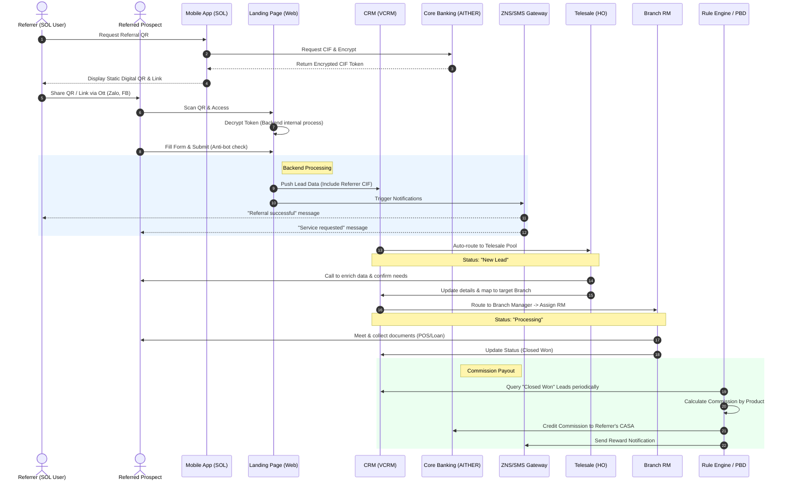

# LEEP Digital Inflow - Data Flow Diagram

```mermaid
sequenceDiagram
    autonumber
    actor Referrer as Referrer (SOL User)
    actor Prospect as Referred Prospect
    participant SOL as Mobile App (SOL)
    participant LP as Landing Page (Web)
    participant VCRM as CRM (VCRM)
    participant Core as Core Banking (AITHER)
    participant ZNS as ZNS/SMS Gateway
    participant TS as Telesale (HO)
    participant RM as Branch RM
    participant PBD as Rule Engine / PBD

    Referrer->>SOL: Request Referral QR
    SOL->>Core: Request CIF & Encrypt
    Core-->>SOL: Return Encrypted CIF Token
    SOL-->>Referrer: Display Static Digital QR & Link
    Referrer->>Prospect: Share QR / Link via Ott (Zalo, FB)
    Prospect->>LP: Scan QR & Access
    LP->>LP: Decrypt Token (Backend internal process)
    Prospect->>LP: Fill Form & Submit (Anti-bot check)
    
    rect rgb(235, 245, 255)
        Note right of LP: Backend Processing
        LP->>VCRM: Push Lead Data (Include Referrer CIF)
        LP->>ZNS: Trigger Notifications
        ZNS-->>Referrer: "Referral successful" message
        ZNS-->>Prospect: "Service requested" message
    end

    VCRM->>TS: Auto-route to Telesale Pool
    Note over TS,VCRM: Status: "New Lead"
    TS->>Prospect: Call to enrich data & confirm needs
    TS->>VCRM: Update details & map to target Branch
    
    VCRM->>RM: Route to Branch Manager -> Assign RM
    Note over RM,VCRM: Status: "Processing"
    RM->>Prospect: Meet & collect documents (POS/Loan)
    RM->>VCRM: Update Status (Closed Won)
    
    rect rgb(235, 255, 240)
        Note right of Core: Commission Payout
        PBD->>VCRM: Query "Closed Won" Leads periodically
        PBD->>PBD: Calculate Commission by Product
        PBD->>Core: Credit Commission to Referrer's CASA
        PBD->>ZNS: Send Reward Notification
    end
```
