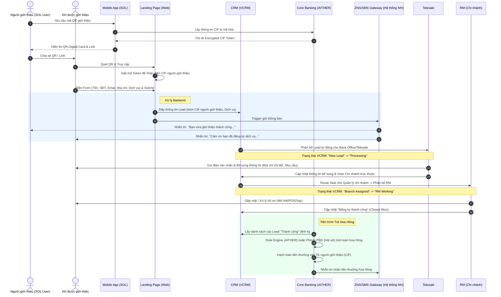

# BẢN ĐỀ XUẤT: LEEP DIGITAL INFLOW - PHASE 1 (MVP REFERRAL MODEL)

## 1. TÓM TẮT DỰ ÁN & MỤC TIÊU CỐT LÕI
**Mục tiêu:** Chuyển đổi mỗi khách hàng/nhân viên đang sử dụng ứng dụng SOL thành một "đại lý số" (Digital Agent) cho thẻ, khoản vay, tài khoản và máy POS của ngân hàng thông qua cơ chế Mã QR định danh.

**Giá trị mang lại:**
* **Tăng trưởng người dùng:** Tận dụng mạng lưới khách hàng hiện hữu để tạo hiệu ứng mạng lưới (Network Effect).
* **Minh bạch & Tự động:** Mọi End-to-End data từ lúc chạm (quét QR) đến khi chốt sale đều được tracking trên VCRM.
* **Tối ưu vận hành:** Tự động hóa phân bổ khách hàng (HO -> Telesale -> Branch -> RM) và đối soát trả thưởng hoa hồng.

---

## 2. TRẢI NGHIỆM NGƯỜI DÙNG & MÔ HÌNH PROTOTYPE
Hành trình được thiết kế tối giản hoá (Frictionless) với các màn hình chính sau:

### 2.1. Prototype Flow (Hành trình Khách hàng)
```mermaid
flowchart TD
    subgraph Người Giới Thiệu (Referrer)
        A1[Mở app SOL] --> A2[Chọn 'Tạo QR Giới thiệu']
        A2 --> A3[Hệ thống tạo QR tĩnh (Permanent) với tham số Encrypted CIF]
        A3 --> A4[Lưu QR về máy hoặc chia sẻ qua Zalo/Facebook]
    end

    subgraph Người Được Giới Thiệu (Referred User)
        B1[Quét QR hoặc Bấm vào Link] --> B2[Mở Landing Page của Shinhan]
        B2 --> B3[Chọn Dịch vụ: POS, Thẻ tín dụng, Vay, Mở TK]
        B3 --> B4[Nhập thông tin: SĐT, Email, Tên, Phường, TP]
        
        B4 --> B5{Kiểm tra BOT/Rate Limit?}
        B5 -- "Nghi ngờ (Hit Rule)" --> B6[Hiển thị Smart Captcha]
        B6 --> B7[Xác thực thành công]
        B5 -- "Bình thường" --> B7[Pass]
        
        B7 --> B8[Hiển thị màn hình Hoàn tất & Cảm ơn]
    end
```

### 2.2. Chiến lược Chống Bot & Spam (Smart Anti-bot)
Để tối ưu UX, hệ thống **không** hiển thị Captcha mặc định.
* **Cơ chế hoạt động:** Sử dụng rate-limiting theo IP/Session và phân tích hành vi (Client-side fingerprinting như thời gian điền form, tốc độ cuộn chuột). Gợi ý sử dụng **Cloudflare Turnstile** hoặc **Google reCAPTCHA v3 (Invisible)**.
* **Hit Rule:** Nếu phát hiện > X requests từ 1 IP trong 5 phút, hoặc thời gian submit form quá nhanh (< 2 giây), hệ thống mới yêu cầu giải Captcha. Hành động này giúp KH thật thao tác mượt mà, chỉ chặn tool/bot spam API.

---

## 3. DATA FLOW & SYSTEM ARCHITECTURE
Sơ đồ mô tả luồng luân chuyển dữ liệu và sự tương tác giữa các hệ thống (App SOL, Landing Page, VCRM, AITHER).
*Lưu ý bảo mật:* Tham số Encrypted CIF trong mã QR là QR tĩnh (Permanent), key giải mã chỉ được lưu trữ và xử lý tại Backend của Landing Page. Khách hàng không thể tự generate mã và không bị lộ số CIF gốc.



---

## 4. QUẢN TRỊ TRẠNG THÁI & PHÂN BỔ CÔNG VIỆC TRÊN VCRM

Đây là một quy tắc BẮT BUỘC: *"Mọi tương tác chạm đến khách hàng đều phải được log trên thẻ Lead/Opportunity của VCRM"*.

**Luồng phân bổ Kanban trên VCRM:**
1. **[Telesale Pool] New Inbound:** Lead đổ về, đính kèm CIF người giới thiệu. Telesale có SLA (ví dụ 24h) để gọi điện.
2. **[Telesale Pool] Contacted/Enriched:** Telesale đã gọi, điền bổ sung trường dữ liệu `Tỉnh/Thành`, `Quận/Huyện`, và `Chi nhánh phục vụ`.
3. **[Branch Pool] Assigned to Branch:** Dựa vào `Chi nhánh phục vụ`, hệ thống tự động đẩy về rổ của Trưởng chi nhánh.
4. **[RM Pipeline] Processing / Meeting:** RM tiếp nhận, tiến hành gặp mặt hoặc thu thập hồ sơ. RM phải log lại note (vd: Đã gặp KH lấy CCCD).
5. **[RM Pipeline] Success / Rejected:** Hoàn tất hành trình. Lý do rejected cũng phải được log API/ghi chú phục vụ phân tích.

---

## 5. TẦM NHÌN PHASE 2: AI-DRIVEN ENGINE

Tích hợp AI để tận dụng mỏ vàng dữ liệu hành vi đã gom được từ Phase 1 và Core Banking (AITHER):

1. **Transaction Behavior Analysis:** Phân tích dòng tiền CASA, lịch sử thanh toán trên POS của Merchant. Nếu dòng tiền tăng đột biến -> Trigger AI gợi ý cho RM chào khoản vay (SOHO Loan).
2. **Next Best Action (NBA) Generator:** VCRM tích hợp Generative AI để gợi ý sẵn cho Telesale/RM kịch bản gọi điện. VD: *"Khách hàng này được giới thiệu mở thẻ tín dụng, nhưng dòng tiền tiền gửi cao, hãy tư vấn thêm sản phẩm Tiền gửi cấu trúc"*.
3. **Churn Prediction:** Phát hiện các khách hàng được giới thiệu nhưng lâu không có giao dịch để RM chăm sóc kịp thời.
